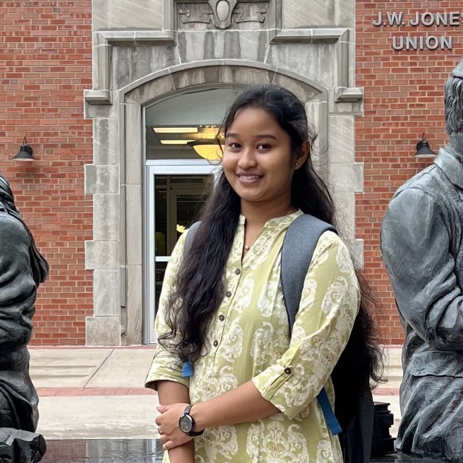

# Farm Shop

## Our Project
   <strong>Project Title   :   </strong> Farm Shop 
   <strong>Project Tagline :   </strong>Shop From Anywhere 
   <strong>Team Name       :   </strong>Spark 
   <strong>Logo            :  
    &nbsp;&nbsp;&nbsp;&nbsp;&nbsp;&nbsp;&nbsp;&nbsp; &nbsp;&nbsp;&nbsp;&nbsp;     </strong> 
    
## Our Team

   &nbsp; 
  &nbsp;                    
                                

  [Mahitha Avula](https://github.com/MahithaAvula25) &nbsp;&nbsp;&nbsp;&nbsp;&nbsp;&nbsp;&nbsp;&nbsp; [SriVyshnaviKshatriya](https://github.com/SriVyshnaviKshatriya)             &nbsp;&nbsp;&nbsp;&nbsp;   [Tejo Lakshmi Tata](https://github.com/TejoTata)    &nbsp;&nbsp;&nbsp;&nbsp;&nbsp;   [Dheeraj krishna Mekala](https://github.com/dheerajkrishna458) &nbsp;&nbsp;  [Kurra kovidh](https://github.com/kurrakovidh) &nbsp;&nbsp;&nbsp;&nbsp;&nbsp;&nbsp;&nbsp;&nbsp; [Narayana Potla](https://github.com/narayanapotla1)             &nbsp;&nbsp;&nbsp;&nbsp;   [Bhavana-Malli](https://github.com/Bhavana-Malli)   

 
## Participants
|     Team Member       | Role          | 
| -------------         |:-------------:|
| Mahitha Avula         | Project Mangaer | 
| Sri Vyshnavi Kshatriya| Scrum Master   | 
| Tejo Lakshmi Tata     | UI Developer     |  
| Person4               | Backend Developer |
| Person5               | Devops Engineer  | 
| Narayana Potla               | Business Analyst     |  
| Bhavana Malli               | Tester |

## Key Contributions
<li>Mahitha Avula will be as a project manager in the team </li>
<li>Sri Vyshnavi will be the scrum master and will be managing the team</li>
<li>Tejo Lakshmi Tata will be UI Developer in the team</li>
<li>person4 contribution</li>
<li>person5 contribution</li>
<li>Narayana potla will be as a business analyst</li>
<li>Bhavana Malli wiil be act as a tester in the team</li>

## Content Summary

[click here](summary.md) to view the content summary for the project

## Group Plan

> Requirement Analysis
* In this group we are deciding the project and gaining basic information to develop the project.
* We find the similar implemenation for the web applications.

> Planning
* We are analysing the total budget for this project development.
* Gathering the required staff for this project
* Dividing the work to develop
* Deciding which platform to implement and work.

> Execution
* In this stage we are developing the code for the project.
* And implemeting some testcases
* Deploy the first version of project

> Testing
* We are running the code with all possible testcases 
* If need any changes in our code, we will implement those modules again and test.
* Deploy the second version of project
* If everything is correct, Will do documentation for the Project and Plan for Release.

> Deployment
* Deploy the final version of project

   
